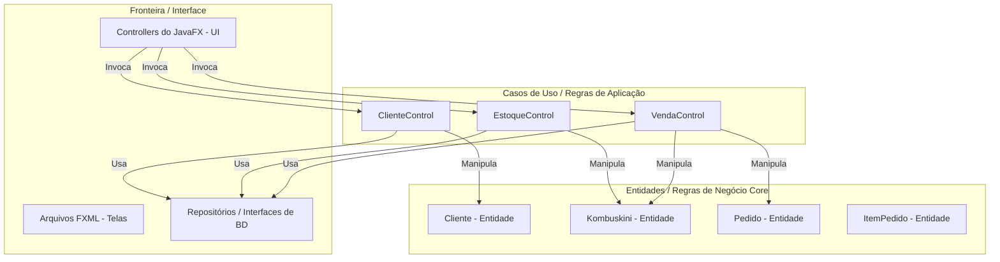

# Proposta de Arquitetura: Sistema Kombuskinis (Java + JavaFX)

Esta proposta detalha a arquitetura do novo sistema de gerenciamento de produção e vendas para a loja de **Kombuskinis**. A arquitetura adota o padrão **BCE (Boundary-Control-Entity)**, também conhecido como Clean Architecture, promovendo desacoplamento, testabilidade e facilidade de manutenção.

## Requisitos do Sistema

### Requisitos Funcionais (RF)

#### Fornecidos pelo Usuário:
*   **1RF - Fazer Vendas:**
    *   **1.1** Cadastrar Clientes.
    *   **1.2** Registrar Pedido.
    *   **1.3** Enviar Pedido.
    *   **1.4** Dar baixa no Pedido (Conclusão).
*   **2RF - Gerenciar Produtos:**
    *   **2.1** Cadastrar Produto.
    *   **2.2** Adicionar Produto no Estoque.
    *   **2.3** Remover Produto do Estoque.
    *   **2.4** Adicionar Produto ao Pedido.
    *   **2.5** Liberar Pedido com todos os produtos dele (baixa automática do estoque de cada item).

#### Requisitos Funcionais Derivados (Elaborados):
*   **3RF - Controle de Fluxo Unidirecional de Pedido:** O status do pedido progride de forma linear e restrita: `RASCUNHO` -> `REGISTRADO` -> `ENVIADO` -> `FINALIZADO`. Apenas pedidos em rascunho podem ter produtos adicionados/removidos.
*   **4RF - Validação de Cadastro Único:** Garantir a não-duplicação de clientes por informações exclusivas como e-mail ou telefone.
*   **5RF - Histórico de Transações de Estoque:** Registrar entradas e saídas de estoque (tanto ajustes manuais quanto as deduções por liberação de pedidos).

---

### Requisitos Não Funcionais (RNF)

#### Fornecidos pelo Usuário:
*   **1RNF - Atributos de Kombuskinis:** Os produtos possuem obrigatoriamente os seguintes atributos: *Cor*, *Quantidade de Nós*, *Quantidade de Divisões* e *Tipo de Cauda*.
*   **2RNF - Validação Multicanal do Cliente:** O cliente pode fazer contato via WhatsApp, Instagram ou E-mail.
    *   WhatsApp exige: Nome + Telefone.
    *   Instagram exige: Nome + Username.
    *   E-mail exige: Nome + E-mail.
    *   *Regra de Negócio:* O cliente pode ter qualquer combinação destas informações, mas **obrigatoriamente deve ter no mínimo duas informações preenchidas**, sendo uma delas **o Nome**.

#### Requisitos Não Funcionais Derivados (Elaborados):
*   **3RNF - Estilo e Interface com JavaFX Puro (Sem CSS):** A customização e o visual da aplicação devem ser implementados nativamente em Java (usando classes como `Background`, `Border`, `Color`) e no FXML, sem arquivos `.css` ou inline.
*   **4RNF - Arquitetura de Software BCE:** Separação estrita de responsabilidades entre as camadas de Fronteira (Boundary), Casos de Uso/Negócio (Control) e Entidades de Domínio (Entity).
*   **5RNF - Banco de Dados Local MySQL:** Persistência dos dados centralizada em um servidor local MySQL, utilizando o driver JDBC e a API de `DriverManager` do Java.
*   **6RNF - Robustez e Integridade do Estoque:** O sistema deve impedir que o estoque fique negativo. A liberação de um pedido com quantidade indisponível no estoque físico deve lançar uma exceção e impedir a liberação.

---

## 1. Visão Geral da Arquitetura BCE

O padrão **Boundary-Control-Entity** divide as responsabilidades em três camadas principais:



1. **Entity (Entidade):** Contém os modelos de domínio e as regras de negócio intrínsecas (validações de dados, regras de cálculo, etc.). Não conhece nada sobre banco de dados, rede ou interface gráfica.
2. **Control (Controle):** Coordena os casos de uso do sistema. Faz a ponte entre as fronteiras (IU) e as entidades, executando a lógica dos fluxos do negócio. *(Nota: Não confundir com os controladores do JavaFX, que fazem parte da camada Boundary)*.
3. **Boundary (Fronteira):** Lida com a interação com o mundo externo. No JavaFX, isso inclui as telas (arquivos `.fxml`), os controladores da UI (que respondem a cliques e eventos de teclado) e as interfaces de banco de dados (Repository Gateways).

---

## 2. Estrutura de Diretórios e Pacotes

Recomendamos a seguinte estrutura padrão para um projeto Maven:

```text
kombuskini-system/
├── src/
│   ├── main/
│   │   ├── java/
│   │   │   └── br/com/kombuskini/
│   │   │       ├── Main.java                 # Ponto de entrada da aplicação JavaFX
│   │   │       ├── entity/                   # Camada de Entidades (BCE - Entity)
│   │   │       │   ├── Cliente.java
│   │   │       │   ├── Kombuskini.java
│   │   │       │   ├── Pedido.java
│   │   │       │   └── ItemPedido.java
│   │   │       ├── control/                  # Camada de Casos de Uso (BCE - Control)
│   │   │       │   ├── ClienteControl.java
│   │   │       │   ├── EstoqueControl.java
│   │   │       │   └── VendaControl.java
│   │   │       └── boundary/                 # Camada de Apresentação (BCE - Boundary)
│   │   │           ├── controller/           # Controladores JavaFX (Eventos de UI)
│   │   │           │   ├── MainController.java
│   │   │           │   ├── ClienteCrudController.java
│   │   │           │   ├── ProdutoCrudController.java
│   │   │           │   ├── EstoqueController.java
│   │   │           │   └── VendaController.java
│   │   │           └── repository/           # Gateways de Acesso a Dados
│   │   │               ├── ClienteRepository.java
│   │   │               ├── KombuskiniRepository.java
│   │   │               ├── PedidoRepository.java
│   │   │               └── impl/             # Implementações JDBC com MySQL
│   │   │                   ├── DatabaseConnection.java
│   │   │                   ├── MySQLClienteRepository.java
│   │   │                   ├── MySQLKombuskiniRepository.java
│   │   │                   └── MySQLPedidoRepository.java
│   │   └── resources/
│   │       ├── br/com/kombuskini/view/       # Arquivos FXML (Telas)
│   │       │   ├── main.fxml
│   │       │   ├── cliente_crud.fxml
│   │       │   ├── produto_crud.fxml
│   │       │   ├── estoque_gerenciador.fxml
│   │       │   └── venda_gerenciador.fxml
│   │       └── db/                           # Scripts SQL ou Base SQLite inicial
│   │           └── schema.sql
└── pom.xml                                   # Configuração de dependências Maven
```

---

## 3. Modelagem de Entidades (Entity)

### 3.1 Cliente.java
Implementa a regra **2RNF**: Deve ter no mínimo duas informações preenchidas, sendo obrigatoriamente uma delas o nome.
```java
package br.com.kombuskini.entity;

public class Cliente {
    private Long id;
    private String nome;
    private String telefone;
    private String instagram;
    private String email;

    public Cliente(Long id, String nome, String telefone, String instagram, String email) {
        this.id = id;
        this.nome = nome;
        this.telefone = telefone;
        this.instagram = instagram;
        this.email = email;
        validate();
    }

    /**
     * Valida as restrições de criação do cliente (Regra 2RNF)
     */
    public final void validate() {
        if (nome == null || nome.trim().isEmpty()) {
            throw new IllegalArgumentException("O nome do cliente é obrigatório.");
        }
        
        int preenchidos = 1; // Nome já está garantido como preenchido
        
        if (telefone != null && !telefone.trim().isEmpty()) {
            preenchidos++;
        }
        if (instagram != null && !instagram.trim().isEmpty()) {
            preenchidos++;
        }
        if (email != null && !email.trim().isEmpty()) {
            preenchidos++;
        }

        if (preenchidos < 2) {
            throw new IllegalArgumentException(
                "O cliente deve possuir pelo menos duas informações, sendo uma delas o Nome " +
                "e a outra um canal de contato (Telefone, Instagram ou E-mail)."
            );
        }
    }

    // Getters e Setters com re-validação nos Setters
    public Long getId() { return id; }
    public void setId(Long id) { this.id = id; }

    public String getNome() { return nome; }
    public void setNome(String nome) { 
        this.nome = nome; 
        validate(); 
    }

    public String getTelefone() { return telefone; }
    public void setTelefone(String telefone) { 
        this.telefone = telefone; 
        validate(); 
    }

    public String getInstagram() { return instagram; }
    public void setInstagram(String instagram) { 
        this.instagram = instagram; 
        validate(); 
    }

    public String getEmail() { return email; }
    public void setEmail(String email) { 
        this.email = email; 
        validate(); 
    }
}
```

### 3.2 Kombuskini.java (Produto)
Implementa os atributos específicos do kombuskini (**1RNF**) e controle de estoque básico (**2RF 2.2 e 2.3**).
```java
package br.com.kombuskini.entity;

public class Kombuskini {
    private Long id;
    private String cor;
    private int quantidadeNos;
    private int quantidadeDivisoes;
    private String tipoCauda; // Ex: Clássica, Sereia, Reta, etc.
    private double preco;
    private int quantidadeEstoque;

    public Kombuskini(Long id, String cor, int quantidadeNos, int quantidadeDivisoes, String tipoCauda, double preco, int quantidadeEstoque) {
        this.id = id;
        this.cor = cor;
        this.quantidadeNos = quantidadeNos;
        this.quantidadeDivisoes = quantidadeDivisoes;
        this.tipoCauda = tipoCauda;
        this.preco = preco;
        this.quantidadeEstoque = quantidadeEstoque;
        validate();
    }

    public final void validate() {
        if (cor == null || cor.trim().isEmpty()) throw new IllegalArgumentException("A cor é obrigatória.");
        if (quantidadeNos < 0) throw new IllegalArgumentException("A quantidade de nós não pode ser negativa.");
        if (quantidadeDivisoes < 0) throw new IllegalArgumentException("A quantidade de divisões não pode ser negativa.");
        if (tipoCauda == null || tipoCauda.trim().isEmpty()) throw new IllegalArgumentException("O tipo de cauda é obrigatório.");
        if (preco < 0) throw new IllegalArgumentException("O preço não pode ser negativo.");
        if (quantidadeEstoque < 0) throw new IllegalArgumentException("A quantidade em estoque não pode ser negativa.");
    }

    public void adicionarEstoque(int qtd) {
        if (qtd <= 0) throw new IllegalArgumentException("A quantidade a adicionar deve ser maior que zero.");
        this.quantidadeEstoque += qtd;
    }

    public void removerEstoque(int qtd) {
        if (qtd <= 0) throw new IllegalArgumentException("A quantidade a remover deve ser maior que zero.");
        if (this.quantidadeEstoque < qtd) {
            throw new IllegalStateException("Estoque insuficiente para remover " + qtd + " unidades. Estoque atual: " + this.quantidadeEstoque);
        }
        this.quantidadeEstoque -= qtd;
    }

    // Getters e Setters...
}
```

### 3.3 Pedido.java e ItemPedido.java
Implementa o ciclo de vida do pedido (Rascunho -> Registrado -> Enviado -> Finalizado) e a liberação de estoque (**1.2, 1.3, 1.4, 2.4 e 2.5**).
```java
package br.com.kombuskini.entity;

import java.util.ArrayList;
import java.util.Collections;
import java.util.List;

public class Pedido {
    public enum StatusPedido {
        RASCUNHO,      // Pedido sendo montado
        REGISTRADO,    // Pedido confirmado e fechado para edição
        ENVIADO,       // Pedido enviado ao cliente
        FINALIZADO     // Pedido entregue e concluído (dado baixa)
    }

    private Long id;
    private Cliente cliente;
    private final List<ItemPedido> itens = new ArrayList<>();
    private StatusPedido status = StatusPedido.RASCUNHO;

    public Pedido(Long id, Cliente cliente) {
        if (cliente == null) throw new IllegalArgumentException("O cliente é obrigatório para abrir um pedido.");
        this.id = id;
        this.cliente = cliente;
    }

    public void adicionarProduto(Kombuskini produto, int quantidade) {
        if (status != StatusPedido.RASCUNHO) {
            throw new IllegalStateException("Não é possível alterar itens de um pedido que não está em Rascunho.");
        }
        for (ItemPedido item : itens) {
            if (item.getProduto().getId().equals(produto.getId())) {
                item.adicionarQuantidade(quantidade);
                return;
            }
        }
        itens.add(new ItemPedido(produto, quantidade));
    }

    public void registrar() {
        if (status != StatusPedido.RASCUNHO) {
            throw new IllegalStateException("Apenas pedidos em Rascunho podem ser registrados.");
        }
        if (itens.isEmpty()) {
            throw new IllegalStateException("Não é possível registrar um pedido sem itens.");
        }
        this.status = StatusPedido.REGISTRADO;
    }

    /**
     * Libera o pedido deduzindo os produtos do estoque.
     * Implementa: '2.5 Liberar Pedido com todos os produtos dele'
     */
    public void liberarEstoque() {
        if (status != StatusPedido.REGISTRADO) {
            throw new IllegalStateException("Apenas pedidos no estado REGISTRADO podem ter o estoque liberado.");
        }
        for (ItemPedido item : itens) {
            item.getProduto().removerEstoque(item.getQuantidade());
        }
    }

    public void enviar() {
        if (status != StatusPedido.REGISTRADO) {
            throw new IllegalStateException("Apenas pedidos REGISTRADOS podem ser enviados.");
        }
        this.status = StatusPedido.ENVIADO;
    }

    public void darBaixa() {
        if (status != StatusPedido.ENVIADO) {
            throw new IllegalStateException("Apenas pedidos ENVIADOS podem ser finalizados (dar baixa).");
        }
        this.status = StatusPedido.FINALIZADO;
    }

    public double getValorTotal() {
        return itens.stream().mapToDouble(ItemPedido::getPrecoTotal).sum();
    }

    public Long getId() { return id; }
    public void setId(Long id) { this.id = id; }
    public Cliente getCliente() { return cliente; }
    public List<ItemPedido> getItens() { return Collections.unmodifiableList(itens); }
    public StatusPedido getStatus() { return status; }
}
```

```java
package br.com.kombuskini.entity;

public class ItemPedido {
    private final Kombuskini produto;
    private int quantidade;

    public ItemPedido(Kombuskini produto, int quantidade) {
        if (produto == null) throw new IllegalArgumentException("Produto não pode ser nulo.");
        if (quantidade <= 0) throw new IllegalArgumentException("Quantidade deve ser maior que zero.");
        this.produto = produto;
        this.quantidade = quantidade;
    }

    public void adicionarQuantidade(int qtd) {
        if (qtd <= 0) throw new IllegalArgumentException("Quantidade adicional deve ser maior que zero.");
        this.quantidade += qtd;
    }

    public double getPrecoTotal() {
        return produto.getPreco() * quantidade;
    }

    public Kombuskini getProduto() { return produto; }
    public int getQuantidade() { return quantidade; }
}
```

---

## 4. Camada de Controle (Control)

Os controles orquestram os fluxos do sistema chamando as entidades e delegando a persistência aos repositórios.

### 4.1 ClienteControl.java
```java
package br.com.kombuskini.control;

import br.com.kombuskini.entity.Cliente;
import br.com.kombuskini.boundary.repository.ClienteRepository;
import java.util.List;

public class ClienteControl {
    private final ClienteRepository repository;

    public ClienteControl(ClienteRepository repository) {
        this.repository = repository;
    }

    public Cliente cadastrar(String nome, String telefone, String instagram, String email) {
        Cliente cliente = new Cliente(null, nome, telefone, instagram, email);
        return repository.save(cliente);
    }

    public void atualizar(Cliente cliente) {
        cliente.validate();
        repository.update(cliente);
    }

    public void excluir(Long id) {
        repository.delete(id);
    }

    public List<Cliente> listarTodos() {
        return repository.findAll();
    }
}
```

### 4.2 EstoqueControl.java
```java
package br.com.kombuskini.control;

import br.com.kombuskini.entity.Kombuskini;
import br.com.kombuskini.boundary.repository.KombuskiniRepository;
import java.util.List;

public class EstoqueControl {
    private final KombuskiniRepository repository;

    public EstoqueControl(KombuskiniRepository repository) {
        this.repository = repository;
    }

    public Kombuskini cadastrarKombuskini(String cor, int nos, int divisoes, String cauda, double preco) {
        Kombuskini kombu = new Kombuskini(null, cor, nos, divisoes, cauda, preco, 0);
        return repository.save(kombu);
    }

    public void adicionarProdutoEstoque(Long id, int quantidade) {
        Kombuskini k = repository.findById(id)
            .orElseThrow(() -> new IllegalArgumentException("Produto não encontrado"));
        k.adicionarEstoque(quantidade);
        repository.update(k);
    }

    public void removerProdutoEstoque(Long id, int quantidade) {
        Kombuskini k = repository.findById(id)
            .orElseThrow(() -> new IllegalArgumentException("Produto não encontrado"));
        k.removerEstoque(quantidade);
        repository.update(k);
    }

    public List<Kombuskini> listarTodos() {
        return repository.findAll();
    }
}
```

### 4.3 VendaControl.java
```java
package br.com.kombuskini.control;

import br.com.kombuskini.entity.*;
import br.com.kombuskini.boundary.repository.*;

public class VendaControl {
    private final PedidoRepository pedidoRepository;
    private final KombuskiniRepository produtoRepository;

    public VendaControl(PedidoRepository pedidoRepository, KombuskiniRepository produtoRepository) {
        this.pedidoRepository = pedidoRepository;
        this.produtoRepository = produtoRepository;
    }

    public Pedido abrirNovoPedido(Cliente cliente) {
        Pedido pedido = new Pedido(null, cliente);
        return pedidoRepository.save(pedido);
    }

    public void adicionarItem(Long pedidoId, Long produtoId, int quantidade) {
        Pedido ped = pedidoRepository.findById(pedidoId)
            .orElseThrow(() -> new IllegalArgumentException("Pedido não encontrado"));
        Kombuskini prod = produtoRepository.findById(produtoId)
            .orElseThrow(() -> new IllegalArgumentException("Produto não encontrado"));

        ped.adicionarProduto(prod, quantidade);
        pedidoRepository.update(ped);
    }

    public void registrarPedido(Long pedidoId) {
        Pedido ped = pedidoRepository.findById(pedidoId)
            .orElseThrow(() -> new IllegalArgumentException("Pedido não encontrado"));
        ped.registrar();
        pedidoRepository.update(ped);
    }

    /**
     * Aplica a baixa no estoque físico (Liberar pedido)
     */
    public void liberarPedido(Long pedidoId) {
        Pedido ped = pedidoRepository.findById(pedidoId)
            .orElseThrow(() -> new IllegalArgumentException("Pedido não encontrado"));
        
        ped.liberarEstoque(); // Modifica as entidades de Kombuskini internamente
        
        // Persiste as alterações de estoque dos produtos
        for (ItemPedido item : ped.getItens()) {
            produtoRepository.update(item.getProduto());
        }
        pedidoRepository.update(ped);
    }

    public void enviarPedido(Long pedidoId) {
        Pedido ped = pedidoRepository.findById(pedidoId)
            .orElseThrow(() -> new IllegalArgumentException("Pedido não encontrado"));
        ped.enviar();
        pedidoRepository.update(ped);
    }

    public void darBaixaNoPedido(Long pedidoId) {
        Pedido ped = pedidoRepository.findById(pedidoId)
            .orElseThrow(() -> new IllegalArgumentException("Pedido não encontrado"));
        ped.darBaixa();
        pedidoRepository.update(ped);
    }
}
```

---

## 5. Camada de Apresentação e Telas (Boundary)

Na camada **Boundary**, os arquivos FXML definem as interfaces gráficas e os controladores do JavaFX delegam a lógica de negócio às classes de controle.

### As 4 Telas de CRUD / Gerenciamento Propostas:

1. **Tela de CRUD de Clientes (`cliente_crud.fxml`)**:
    - Tabela listando todos os clientes.
    - Formulário lateral para cadastrar/editar. Campos: *Nome (obrigatório)*, *Telefone*, *Instagram Username*, *E-mail*.
    - Botões: *Novo*, *Salvar*, *Excluir*.
    - Tratamento de erro visual caso a regra de pelo menos 2 dados não seja atendida.

2. **Tela de CRUD de Kombuskinis (`produto_crud.fxml`)**:
    - Tabela listando produtos cadastrados.
    - Formulário lateral para cadastrar/editar. Campos: *Cor*, *Quantidade de Nós*, *Quantidade de Divisões*, *Tipo de Cauda*, *Preço*.
    - Botões: *Novo*, *Salvar*, *Excluir*.

3. **Tela de Controle de Estoque (`estoque_gerenciador.fxml`)**:
    - Tabela focada na visualização do estoque atual de cada Kombuskini.
    - Painel de Ação rápida para selecionar um Kombuskini e digitar uma quantidade para **Adicionar ao Estoque** (Entrada) ou **Remover do Estoque** (Saída/Ajuste manual).
    - Indicadores visuais de estoque baixo (ex: cor amarela/vermelha caso estoque < 5).

4. **Tela de Pedidos e Vendas (`venda_gerenciador.fxml`)**:
    - Tela dividida em duas partes:
        - **Esquerda (Filtro e Lista de Pedidos):** Tabela mostrando os pedidos cadastrados e seus respectivos status (Rascunho, Registrado, Enviado, Finalizado).
        - **Direita (Detalhes e Fluxo de Venda):** Painel interativo para o pedido selecionado:
            - Seleção de Cliente e adição de Kombuskinis + quantidade para o pedido.
            - Ações de Fluxo baseadas em botões que ficam ativos/inativos conforme o status do pedido:
                - **Registrar:** Fecha a edição e passa o pedido para `REGISTRADO`.
                - **Liberar Estoque:** Processa o desconto dos Kombuskinis do estoque atual do sistema.
                - **Enviar:** Marca o pedido como `ENVIADO` (pronto para transporte).
                - **Dar Baixa:** Finaliza o pedido como entregue e concluído (`FINALIZADO`).

---

## 6. Estilo Visual e Recursos com JavaFX Puro (Sem CSS)

Como o projeto deve utilizar exclusivamente recursos nativos do JavaFX sem arquivos CSS, o design e estilo visual dos componentes devem ser programados diretamente em Java ou definidos no arquivo FXML através de propriedades de layout e visuais.

### 6.1 Customização Visual via Código Java (JavaFX API)
Você pode usar as classes da API do JavaFX (`Background`, `Border`, `Color`, `Font`, `Insets`) para configurar o estilo visual de forma programática.

**Exemplo: Botão Estilizado (Cantos Arredondados, Cor de Fundo, Borda e Fonte):**
```java
import javafx.geometry.Insets;
import javafx.scene.control.Button;
import javafx.scene.layout.*;
import javafx.scene.paint.Color;
import javafx.scene.text.Font;
import javafx.scene.text.FontWeight;

public class UiStyleHelper {

    public static void estilizarBotaoSucesso(Button botao) {
        // Fonte do botão
        botao.setFont(Font.font("System", FontWeight.BOLD, 14));
        
        // Cor do texto (Branco)
        botao.setTextFill(Color.WHITE);
        
        // Fundo Verde Arredondado
        BackgroundFill fill = new BackgroundFill(
            Color.web("#2e7d32"), // Cor hexadecimal
            new CornerRadii(6),   // Raio dos cantos (cantos arredondados)
            Insets.EMPTY
        );
        botao.setBackground(new Background(fill));

        // Borda Fina
        BorderStroke stroke = new BorderStroke(
            Color.web("#1b5e20"),
            BorderStrokeStyle.SOLID,
            new CornerRadii(6),
            new BorderWidths(1)
        );
        botao.setBorder(new Border(stroke));
        
        // Espaçamento interno
        botao.setPadding(new Insets(10, 20, 10, 20));
    }
}
```

### 6.2 Propriedades Visuais Diretamente no FXML
Diversos atributos de estilo podem ser configurados nas próprias tags FXML para evitar o uso de código Java repetitivo:

*   **Cor do Texto:** `textFill="#2e7d32"` ou `textFill="WHITE"`
*   **Margem e Padding:**
    ```xml
    <VBox spacing="10">
        <padding>
            <Insets top="15.0" right="15.0" bottom="15.0" left="15.0"/>
        </padding>
    </VBox>
    ```
*   **Fontes:**
    ```xml
    <Label text="Gerenciador de Vendas">
        <font>
            <Font name="System Bold" size="20.0" />
        </font>
    </Label>
    ```

### 6.3 Banco de Dados e Ícones
1. **Banco de Dados MySQL Local:**
    - Utilização de servidor local MySQL para persistência de dados.
    - Dependência recomendada no `pom.xml`: `mysql-connector-j` para obter o driver JDBC correspondente.
    - A classe `DatabaseConnection.java` encapsulará a inicialização da conexão JDBC via `DriverManager.getConnection("jdbc:mysql://localhost:3306/kombuskini_db", "root", "senha")`.
2. **Imagens Nativas no JavaFX:**
    - Em vez de usar fontes de ícones que dependem de CSS, use a classe `ImageView` nativa para carregar pequenos ícones PNG/SVG salvos na pasta de recursos (`src/main/resources/images/`).

---

## 7. Exemplo de Controlador JavaFX (Boundary)

Abaixo está um rascunho de como um controlador da tela de Clientes deve interagir com o controle de negócio:

```java
package br.com.kombuskini.boundary.controller;

import br.com.kombuskini.control.ClienteControl;
import br.com.kombuskini.entity.Cliente;
import javafx.fxml.FXML;
import javafx.scene.control.*;

public class ClienteCrudController {

    @FXML private TextField txtNome;
    @FXML private TextField txtTelefone;
    @FXML private TextField txtInstagram;
    @FXML private TextField txtEmail;
    @FXML private TableView<Cliente> tblClientes;

    private final ClienteControl clienteControl;

    // Construtor com Injeção de Dependência
    public ClienteCrudController(ClienteControl clienteControl) {
        this.clienteControl = clienteControl;
    }

    @FXML
    public void handleSalvar() {
        try {
            String nome = txtNome.getText();
            String telefone = txtTelefone.getText();
            String instagram = txtInstagram.getText();
            String email = txtEmail.getText();

            // Delega para o controle de negócios (Control)
            clienteControl.cadastrar(nome, telefone, instagram, email);
            
            exibirAlerta("Sucesso", "Cliente cadastrado com sucesso!", Alert.AlertType.INFORMATION);
            atualizarTabela();
            limparFormulario();
        } catch (IllegalArgumentException e) {
            // Captura erros de validação da entidade (como a regra 2RNF)
            exibirAlerta("Erro de Validação", e.getMessage(), Alert.AlertType.WARNING);
        } catch (Exception e) {
            exibirAlerta("Erro", "Ocorreu um erro ao salvar o cliente.", Alert.AlertType.ERROR);
        }
    }

    private void exibirAlerta(String titulo, String mensagem, Alert.AlertType tipo) {
        Alert alert = new Alert(tipo);
        alert.setTitle(titulo);
        alert.setHeaderText(null);
        alert.setContentText(mensagem);
        alert.showAndWait();
    }
    
    private void atualizarTabela() {
        tblClientes.getItems().setAll(clienteControl.listarTodos());
    }
    
    private void limparFormulario() {
        txtNome.clear();
        txtTelefone.clear();
        txtInstagram.clear();
        txtEmail.clear();
    }
}
```
